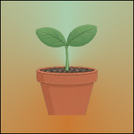

# 마음의 화분

<p align="center">
  
</p>

<p align="center">
  <strong>긍정의 말로 식물을 키우고, 부정의 감정은 안전하게 내려놓는 힐링 챗봇 게임</strong>
</p>

말을 걸면 화분의 새싹이 자라고, 힘든 마음은 화분이 대신 받아 줍니다.  
[동물의 숲](https://www.animal-crossing.com/)처럼 몽글몽글한 정원에서, 감정 일기와 가벼운 게임이 하나로 이어집니다.

> 이 앱은 의료·심리 상담을 대체하지 않습니다. 위기 상황에서는 1393(자살예방상담전화), 129(보건복지상담) 등 전문 기관의 도움을 받아 주세요.

---

## 이런 앱입니다

**마음의 화분**은 감정을 말로 꺼내 보는 습관을 식물 키우기로 만든 웹 게임입니다.

- 따뜻한 말, 기쁜 말을 하면 새싹의 HP가 오르고 레벨이 올라갑니다.
- 힘든 말, 부정적인 감정은 식물을 잠시 시들게 하지만, 그 마음 역시 기록되고 받아들여집니다.
- 화분에 물을 주고, 후회를 감사로 바꿔 뿌리를 깊게 내리며, 여정 지도에서 성장의 발자국을 확인합니다.

게스트로도 바로 플레이할 수 있고, 로그인하면 레벨·HP·채팅이 계정에 저장되어 다른 기기에서도 이어집니다.

---

## 주요 기능

### 홈 — 화분과 대화

- AI 힐링 봇과 짧게 대화합니다. 문장의 감정(긍정 / 부정 / 중립)에 따라 식물이 자라거나 시듭니다.
- HP가 가득 차면 레벨 업하고, 새싹 모습이 단계적으로 바뀝니다.
- 씨앗을 터치하면 물을 줄 수 있고, 화분에 이름을 붙일 수 있습니다.
- AI를 쓸 수 없는 환경에서는 따뜻한 기본 멘트로 대화가 이어집니다.

### 뿌리 강화

- 후회했던 일을 떠올린 뒤, 그 안에서 감사할 점을 찾아 적습니다.
- 세션을 마치면 뿌리 HP가 오르고, 지하 여정이 열립니다.

### 여정

- **지상**: 씨앗의 언덕 → 새싹의 초원 → 개화의 숲
- **지하**: 표토의 길 → 마음 동굴 → 감사의 유적 → 뿌리내린 심연
- 이정표를 달성하면 포션을 받습니다.
- 매일 **마음 기록하기**, **물 주기**, **뿌리 강화하기** 퀘스트가 있고, 모두 완료하면 보너스 포션이 지급됩니다.

### 캘린더

- 날짜별로 대화와 감정(기쁨, 사랑, 평온, 불안, 슬픔, 분노 등)을 돌아봅니다.

### 상점 · 보관함

- 포션으로 배경, 화분 스킨 등 꾸미기 아이템을 구매합니다.
- 성장·HP·레벨에는 영향을 주지 않는 순수 꾸미기입니다.
- 기본 배경: 햇살 창가, 몽글 베이지, 푸른 초원
- 상점 배경: 밤하늘, 비 오는 창가, 벚꽃 정원, 첫눈, 노을 바다, 안개 숲 등

### 로그인 · 동기화

- 이메일 가입/로그인, Google 로그인
- 로그인 시 게임 상태가 Supabase에 저장됩니다. 게스트 진행은 브라우저에만 남습니다.

---

## 기술 스택

| 구분 | 사용 |
| --- | --- |
| 프레임워크 | [Next.js](https://nextjs.org/) 16 (App Router), React 19 |
| 스타일 | Tailwind CSS 4 |
| 인증 · DB | [Supabase](https://supabase.com/) (Auth, Postgres, RLS) |
| AI 대화 | [Vercel AI SDK](https://ai-sdk.dev/) + AI Gateway / Gemini |
| 배포 | Vercel에 올리기 좋은 구조 |

---

## 화면

| 경로 | 설명 |
| --- | --- |
| `/` | 홈 — 화분, 채팅, 물 주기, 뿌리 강화 |
| `/journey` | 여정 지도와 일일 퀘스트 |
| `/calendar` | 감정 캘린더와 그날의 대화 |
| `/store` | 포션 상점 |
| `/item` | 보유 아이템 · 장착 |
| `/settings` | 닉네임, 화분 이름, BGM, 클릭음 |
| `/login` | 로그인 · 회원가입 |

PWA로 홈 화면에 추가할 수 있습니다.

---

## 시작하기

필요 환경: Node.js 20+, npm

```bash
git clone https://github.com/tickle1231102-cmd/my-mind-01.git
cd my-mind-01
npm install
```

프로젝트 루트에 `.env.local`을 만들고 아래 값을 채웁니다.

```bash
# Supabase (로그인·클라우드 저장)
NEXT_PUBLIC_SUPABASE_URL=your-supabase-url
NEXT_PUBLIC_SUPABASE_ANON_KEY=your-supabase-anon-key

# AI 대화 (둘 중 하나. 없으면 기본 멘트로 동작)
AI_GATEWAY_API_KEY=your-ai-gateway-key
# 또는
GEMINI_API_KEY=your-gemini-key
```

데이터베이스 스키마는 `supabase/mind_schema.sql`을 참고하세요. 각 사용자는 자신의 프로필·게임 상태만 읽고 쓸 수 있습니다.

개발 서버:

```bash
npm run dev
```

브라우저에서 [http://localhost:3000](http://localhost:3000)을 엽니다.

```bash
npm run build
npm start
```

---

## 플레이 한 줄 요약

말을 남기면 식물이 자랍니다.  
힘든 마음도 괜찮아요. 이 정원은 당신 편입니다.
